```mermaid
sequenceDiagram
    autonumber
    actor Controller as Maintenance Controller
    participant UI as Next.js Frontend
    participant API as Single Unified Endpoint (/block-windows/recommendation/)
    participant AI as Embedded CP-SAT Engine

    rect rgb(20, 30, 50)
    note right of Controller: STEP 1: Pre-Creation Slot Discovery
    Controller->>UI: Selects Maintenance Task (TMS-696) & Date (2026-09-08)
    UI->>API: POST /railways/block-windows/recommendation/ {task_id, date}
    API->>AI: Resolves section, creates 24h horizon, runs CP-SAT
    AI-->>API: Optimal slots with decision scores
    API-->>UI: 200 OK (recommended_slot + windows array)
    end

    rect rgb(30, 20, 40)
    note right of Controller: STEP 2: Block Window Creation
    Controller->>UI: Selects slot (e.g., 03:00 - 05:00)
    UI->>API: POST /railways/block-windows/ {section, start_time, end_time, status}
    API-->>UI: 201 Created (BlockWindow ID: 1)
    end

    rect rgb(20, 40, 30)
    note right of Controller: STEP 3: Continuous Monitoring / AI Optimization
    Controller->>UI: Opens Block Window #1 or detects timetable change
    UI->>API: POST /railways/block-windows/recommendation/ {block_window_id: 1, task_id: "TMS-696"}
    API->>AI: Evaluate train conflicts in current slot & compute better slots
    AI-->>API: Conflict found! Conflict-free slot recommended
    API-->>UI: 200 OK (has_better_slot: true, recommended_slot, suggested_put_payload)
    end

    rect rgb(40, 20, 30)
    note right of Controller: STEP 4: 1-Click Reschedule / Apply
    Controller->>UI: Clicks "Accept AI Slot"
    UI->>API: POST /railways/block-windows/recommendation/ {block_window_id: 1, apply: true}
    API-->>UI: 200 OK (applied: true, block_window updated in DB)
    UI->>Controller: Displays Success Toast & refreshed timetable
    end
```

# Frontend Integration Guide: AI Maintenance Window Scheduling & Unified Recommendation

> [!TIP]
> **Merged Single Endpoint Available**:
> All 3 previous endpoints (`feasible-windows`, `{id}/recommendation`, and `{id}/apply-recommendation`) are now merged into **one unified endpoint**:
> **`POST /railways/block-windows/recommendation/`** (also supports `GET /railways/block-windows/recommendation/`).
> You can use this single endpoint across the entire workflow!

---

## 📌 Complete Unified Workflow & Single Endpoint Architecture

### One Single Endpoint: `/railways/block-windows/recommendation/`

| Action Needed | Method & URL | Payload / Query Params |
| :--- | :--- | :--- |
| **1. Find Slots Before Creation** | `POST /railways/block-windows/recommendation/` | `{ "task_id": "TMS-696", "date": "2026-09-08" }` |
| **2. Check AI Recommendation For Block** | `POST /railways/block-windows/recommendation/` (or `GET`) | `{ "block_window_id": 1, "task_id": "TMS-696" }` |
| **3. 1-Click Apply / Update AI Slot** | `POST /railways/block-windows/recommendation/` | `{ "block_window_id": 1, "task_id": "TMS-696", "apply": true }` |

---



---

## 1. Unified API Endpoint Contract: `/railways/block-windows/recommendation/`

> [!IMPORTANT]
> **What Changed in this Endpoint:**
> - **Old Request (Deprecated)**: Required `task_id` and `block_window_id`. This created a chicken-and-egg problem because a block window had to be created in the database before you could check if it was feasible.
> - **New Request (Current)**: Accepts `task_id` and `date` (`YYYY-MM-DD`). The backend automatically looks up `task.asset.section`, generates an internal 24-hour virtual planning horizon, and evaluates the in-memory **Google OR-Tools CP-SAT discrete constraint optimizer** (or gap fallback). **No pre-existing database BlockWindow is needed!**

#### Request Payload:
```http
POST /railways/block-windows/feasible-windows/
Content-Type: application/json

{
  "task_id": "TMS-696",
  "date": "2026-09-04"
}
```

| Field | Type | Required | Description |
| :--- | :---: | :---: | :--- |
| `task_id` | `string` | **Yes** | Unique task identifier (e.g. `"TMS-696"` or `"TASK-OHE-101"`). Supports tasks in `PENDING` or `SCHEDULED` status. |
| `date` | `string` | **Yes** | Target planning date in `YYYY-MM-DD` format. |

#### Response Payload (`200 OK`):
```json
{
  "task_id": "TMS-696",
  "date": "2026-09-04",
  "section": {
    "id": 10,
    "name": "Surat-Mumbai",
    "source": "Surat",
    "source_code": "ST",
    "destination": "Mumbai",
    "destination_code": "MMCT"
  },
  "required_duration_minutes": 45,
  "feasible": true,
  "windows": [
    {
      "start": "2026-09-04 00:00:00",
      "end": "2026-09-04 01:00:00",
      "duration_minutes": 60,
      "decision_score": 0.395,
      "algorithm": "CP-SAT Constraint Solver"
    }
  ]
}
```

| Response Field | Type | Description |
| :--- | :---: | :--- |
| `task_id` | `string` | The task evaluated. |
| `date` | `string` | Target service date queried. |
| `section` | `object` | Complete corridor section details (`id`, `name`, station codes). |
| `required_duration_minutes` | `integer` | Duration required by the maintenance task. |
| `feasible` | `boolean` | `true` if at least one collision-free window was allocated. |
| `windows` | `array` | List of candidate slots. Each slot includes `start`, `end`, `duration_minutes`, `decision_score` (guaranteed non-null, `0.0` - `1.0`), and `algorithm` (`"CP-SAT Constraint Solver"` or `"Database Timestamp Gap"`). |

---

### 1.2 Create Block Window (`POST /railways/block-windows/`)
When the user picks a candidate window from the feasible windows list:

#### Request Payload:
```http
POST /railways/block-windows/
Content-Type: application/json

{
  "section": 10,
  "start_time": "2026-09-04 00:00:00",
  "end_time": "2026-09-04 01:00:00",
  "status": "RESERVED"
}
```

#### Response (`201 Created`):
```json
{
  "id": 1,
  "section": 10,
  "section_name": "Surat-Mumbai",
  "start_time": "2026-09-04 00:00:00",
  "end_time": "2026-09-04 01:00:00",
  "status": "RESERVED"
}
```

---

### 1.3 Fetch Continuous AI Recommendation (`GET /railways/block-windows/{id}/recommendation/`)
For an existing block window, the AI continuously monitors for train collisions and checks if a better slot has opened up.

#### Request:
```http
GET /railways/block-windows/1/recommendation/?task_id=TMS-696
```
*(Query param `task_id` is optional. If omitted, the engine automatically selects the highest-priority pending/scheduled task on that section).*

#### Response (`200 OK`):
```json
{
  "block_window_id": 1,
  "task_id": "TMS-696",
  "section": {
    "id": 10,
    "name": "Surat-Mumbai",
    "source": "Surat",
    "source_code": "ST",
    "destination": "Mumbai",
    "destination_code": "MMCT"
  },
  "current_slot": {
    "start_time": "2026-09-04 13:00:00",
    "end_time": "2026-09-04 17:00:00",
    "duration_minutes": 240,
    "status": "RESERVED",
    "has_conflict": true,
    "conflict_count": 1,
    "conflicts": [
      {
        "train_number": "12002",
        "train_name": "New Delhi - Bhopal Shatabdi Express",
        "entry_time": "2026-09-04 14:00:00",
        "exit_time": "2026-09-04 14:35:00"
      }
    ]
  },
  "has_better_slot": true,
  "recommendation_reason": "Current window has 1 train conflict(s) with train(s) 12002. AI recommends shifting to 03:00:00 - 05:00:00 which is 100% collision-free with a decision score of 0.850.",
  "recommended_slot": {
    "start": "2026-09-04 03:00:00",
    "end": "2026-09-04 05:00:00",
    "duration_minutes": 120,
    "decision_score": 0.85,
    "algorithm": "CP-SAT Constraint Solver"
  },
  "suggested_put_payload": {
    "section": 10,
    "start_time": "2026-09-04 03:00:00",
    "end_time": "2026-09-04 05:00:00",
    "status": "RESERVED"
  },
  "put_url": "/railways/block-windows/1/"
}
```

---

### 1.4 Update Block Window (`PUT /railways/block-windows/{id}/`)
The frontend takes `response.data.suggested_put_payload` and sends it via `PUT` to update the slot.

#### Request Body:
```json
PUT /railways/block-windows/1/
Content-Type: application/json

{
  "section": 10,
  "start_time": "2026-09-04 03:00:00",
  "end_time": "2026-09-04 05:00:00",
  "status": "RESERVED"
}
```

#### Response (`200 OK`):
```json
{
  "id": 1,
  "section": 10,
  "section_name": "Surat-Mumbai",
  "start_time": "2026-09-04 03:00:00",
  "end_time": "2026-09-04 05:00:00",
  "status": "RESERVED"
}
```

---

## 2. TypeScript Interfaces

Add these data contracts to your frontend (e.g. `src/types/blockWindow.ts`):

```typescript
export interface SectionSummary {
  id: number;
  name: string;
  source: string;
  source_code: string;
  destination: string;
  destination_code: string;
}

export interface FeasibleWindowItem {
  start: string;
  end: string;
  duration_minutes: number;
  decision_score: number | null;
  algorithm: 'CP-SAT Constraint Solver' | 'Database Timestamp Gap';
}

export interface FeasibleWindowsRequest {
  task_id: string;
  date: string; // YYYY-MM-DD
}

export interface FeasibleWindowsResponse {
  task_id: string;
  date: string;
  section: SectionSummary;
  required_duration_minutes: number;
  feasible: boolean;
  windows: FeasibleWindowItem[];
}

export interface BlockWindow {
  id: number;
  section: number;
  section_name?: string;
  start_time: string;
  end_time: string;
  status: 'AVAILABLE' | 'RESERVED' | 'BLOCKED';
}

export interface CreateBlockWindowPayload {
  section: number;
  start_time: string;
  end_time: string;
  status?: 'AVAILABLE' | 'RESERVED' | 'BLOCKED';
}

export interface ConflictTrain {
  train_number: string;
  train_name: string;
  entry_time: string;
  exit_time: string;
}

export interface CurrentSlotInfo {
  start_time: string;
  end_time: string;
  duration_minutes: number;
  status: string;
  has_conflict: boolean;
  conflict_count: number;
  conflicts: ConflictTrain[];
}

export interface BlockWindowPutPayload {
  section: number;
  start_time: string;
  end_time: string;
  status: string;
}

export interface BlockRecommendationResponse {
  block_window_id: number;
  task_id: string | null;
  section: SectionSummary;
  current_slot: CurrentSlotInfo;
  has_better_slot: boolean;
  recommendation_reason: string;
  recommended_slot: FeasibleWindowItem | null;
  suggested_put_payload: BlockWindowPutPayload | null;
  put_url: string;
}
```

---

## 3. API Client Methods

Add these methods to your API service file (`src/services/blockService.ts`):

```typescript
import axios from 'axios';
import {
  FeasibleWindowsRequest,
  FeasibleWindowsResponse,
  BlockWindow,
  CreateBlockWindowPayload,
  BlockRecommendationResponse,
  BlockWindowPutPayload,
} from '@/types/blockWindow';

const API_BASE = process.env.NEXT_PUBLIC_API_URL || 'http://127.0.0.1:8000/railways';

export const blockService = {
  /**
   * Phase 1: Search feasible maintenance windows for a task on a target date
   */
  async getFeasibleWindows(payload: FeasibleWindowsRequest): Promise<FeasibleWindowsResponse> {
    const response = await axios.post<FeasibleWindowsResponse>(
      `${API_BASE}/block-windows/feasible-windows/`,
      payload
    );
    return response.data;
  },

  /**
   * Phase 2: Create a new BlockWindow in the database
   */
  async createBlockWindow(payload: CreateBlockWindowPayload): Promise<BlockWindow> {
    const response = await axios.post<BlockWindow>(
      `${API_BASE}/block-windows/`,
      payload
    );
    return response.data;
  },

  /**
   * Phase 3A: Query continuous AI recommendation for an existing block window
   */
  async getRecommendation(blockWindowId: number, taskId?: string): Promise<BlockRecommendationResponse> {
    const params = taskId ? { task_id: taskId } : {};
    const response = await axios.get<BlockRecommendationResponse>(
      `${API_BASE}/block-windows/${blockWindowId}/recommendation/`,
      { params }
    );
    return response.data;
  },

  /**
   * Phase 3B: Apply recommended slot via standard PUT request
   */
  async updateBlockWindow(blockWindowId: number, payload: BlockWindowPutPayload): Promise<BlockWindow> {
    const response = await axios.put<BlockWindow>(
      `${API_BASE}/block-windows/${blockWindowId}/`,
      payload
    );
    return response.data;
  },

  /**
   * Phase 3C (Alternative): 1-Click Auto-Apply endpoint
   */
  async applyRecommendation(blockWindowId: number, taskId?: string): Promise<BlockWindow> {
    const response = await axios.post(
      `${API_BASE}/block-windows/${blockWindowId}/apply-recommendation/`,
      {},
      { params: taskId ? { task_id: taskId } : {} }
    );
    return response.data.block_window;
  },
};
```

---

## 4. React Hooks

### 4.1 `useFeasibleWindows` (For Creating Blocks)
```typescript
// src/hooks/useFeasibleWindows.ts
import { useState } from 'react';
import { blockService } from '@/services/blockService';
import { FeasibleWindowsResponse, FeasibleWindowItem, BlockWindow } from '@/types/blockWindow';

export function useFeasibleWindows() {
  const [data, setData] = useState<FeasibleWindowsResponse | null>(null);
  const [loading, setLoading] = useState(false);
  const [creating, setCreating] = useState(false);
  const [error, setError] = useState<string | null>(null);

  const searchFeasibleWindows = async (taskId: string, date: string) => {
    setLoading(true);
    setError(null);
    try {
      const res = await blockService.getFeasibleWindows({ task_id: taskId, date });
      setData(res);
      return res;
    } catch (err: any) {
      setError(err?.response?.data?.error || err.message || 'Failed to calculate feasible windows');
      throw err;
    } finally {
      setLoading(false);
    }
  };

  const selectAndCreateBlock = async (windowItem: FeasibleWindowItem): Promise<BlockWindow> => {
    if (!data) throw new Error('No section context available');
    setCreating(true);
    try {
      const created = await blockService.createBlockWindow({
        section: data.section.id,
        start_time: windowItem.start,
        end_time: windowItem.end,
        status: 'RESERVED',
      });
      return created;
    } finally {
      setCreating(false);
    }
  };

  return {
    data,
    loading,
    creating,
    error,
    searchFeasibleWindows,
    selectAndCreateBlock,
  };
}
```

---

### 4.2 `useBlockRecommendation` (For Monitoring & Rescheduling)
```typescript
// src/hooks/useBlockRecommendation.ts
import { useState, useEffect, useCallback } from 'react';
import { blockService } from '@/services/blockService';
import { BlockRecommendationResponse, BlockWindow } from '@/types/blockWindow';

export function useBlockRecommendation(blockWindowId: number, taskId?: string) {
  const [recommendation, setRecommendation] = useState<BlockRecommendationResponse | null>(null);
  const [loading, setLoading] = useState(true);
  const [updating, setUpdating] = useState(false);
  const [error, setError] = useState<string | null>(null);

  const fetchRecommendation = useCallback(async () => {
    if (!blockWindowId) return;
    setLoading(true);
    setError(null);
    try {
      const res = await blockService.getRecommendation(blockWindowId, taskId);
      setRecommendation(res);
    } catch (err: any) {
      setError(err?.response?.data?.error || err.message);
    } finally {
      setLoading(false);
    }
  }, [blockWindowId, taskId]);

  useEffect(() => {
    fetchRecommendation();
  }, [fetchRecommendation]);

  const acceptRecommendation = async (): Promise<BlockWindow | undefined> => {
    if (!recommendation?.suggested_put_payload) return;
    setUpdating(true);
    try {
      const updated = await blockService.updateBlockWindow(
        blockWindowId,
        recommendation.suggested_put_payload
      );
      await fetchRecommendation(); // Refresh to confirm zero conflicts
      return updated;
    } catch (err: any) {
      setError(err?.response?.data?.detail || err.message);
      throw err;
    } finally {
      setUpdating(false);
    }
  };

  return {
    recommendation,
    loading,
    updating,
    error,
    refresh: fetchRecommendation,
    acceptRecommendation,
  };
}
```

---

## 5. Ready-to-Use UI Component (Recommendation & Rescheduling Banner)

```tsx
// src/components/AIBlockRecommendationBanner.tsx
import React from 'react';
import { useBlockRecommendation } from '@/hooks/useBlockRecommendation';

interface Props {
  blockWindowId: number;
  taskId?: string;
  onSlotUpdated?: () => void;
}

export const AIBlockRecommendationBanner: React.FC<Props> = ({
  blockWindowId,
  taskId,
  onSlotUpdated,
}) => {
  const { recommendation, loading, updating, error, acceptRecommendation } =
    useBlockRecommendation(blockWindowId, taskId);

  if (loading) {
    return (
      <div className="p-4 bg-slate-900 border border-slate-800 rounded-lg animate-pulse text-slate-400 text-sm">
        🤖 Analyzing corridor traffic and computing CP-SAT discrete slot recommendation...
      </div>
    );
  }

  if (error || !recommendation) return null;

  const { current_slot, has_better_slot, recommendation_reason, recommended_slot } = recommendation;

  if (!has_better_slot) {
    return (
      <div className="p-4 bg-emerald-950/40 border border-emerald-800/60 rounded-lg flex items-center justify-between">
        <div className="flex items-center gap-3">
          <span className="text-xl">✅</span>
          <div>
            <h4 className="text-emerald-300 font-semibold text-sm">Optimal Slot Confirmed</h4>
            <p className="text-emerald-400/80 text-xs mt-0.5">{recommendation_reason}</p>
          </div>
        </div>
      </div>
    );
  }

  return (
    <div
      className={`p-4 rounded-xl border ${
        current_slot.has_conflict
          ? 'bg-rose-950/30 border-rose-800/80'
          : 'bg-indigo-950/30 border-indigo-800/80'
      }`}
    >
      <div className="flex items-start justify-between gap-4">
        <div className="space-y-2">
          <div className="flex items-center gap-2">
            <span
              className={`px-2 py-0.5 text-xs font-semibold rounded ${
                current_slot.has_conflict
                  ? 'bg-rose-900 text-rose-200 animate-pulse'
                  : 'bg-indigo-900 text-indigo-200'
              }`}
            >
              {current_slot.has_conflict
                ? `⚠️ ${current_slot.conflict_count} Train Conflict(s) Detected`
                : '💡 AI Slot Optimization Available'}
            </span>

            {recommended_slot?.decision_score !== null && (
              <span className="px-2 py-0.5 text-xs font-medium bg-emerald-900/80 text-emerald-200 rounded">
                AI Score: {(recommended_slot.decision_score * 100).toFixed(0)}%
              </span>
            )}
          </div>

          <p className="text-sm text-slate-200 leading-snug">{recommendation_reason}</p>

          <div className="grid grid-cols-2 gap-3 mt-3 pt-3 border-t border-slate-800 text-xs">
            <div>
              <span className="text-slate-400 block mb-0.5">Current Slot:</span>
              <span className="font-mono text-slate-300">
                {current_slot.start_time.slice(11, 16)} – {current_slot.end_time.slice(11, 16)}
              </span>
            </div>
            <div>
              <span className="text-emerald-400 font-semibold block mb-0.5">AI Recommended Slot:</span>
              <span className="font-mono text-emerald-300 font-bold">
                {recommended_slot?.start.slice(11, 16)} – {recommended_slot?.end.slice(11, 16)}
              </span>
              <span className="ml-2 text-slate-400">({recommended_slot?.duration_minutes} mins)</span>
            </div>
          </div>
        </div>

        <button
          onClick={async () => {
            await acceptRecommendation();
            if (onSlotUpdated) onSlotUpdated();
          }}
          disabled={updating}
          className="shrink-0 px-4 py-2 bg-gradient-to-r from-emerald-600 to-teal-600 hover:from-emerald-500 hover:to-teal-500 text-white font-medium text-xs rounded-lg transition-all shadow-md hover:shadow-emerald-900/30 disabled:opacity-50"
        >
          {updating ? 'Updating Slot...' : '⚡ Accept AI Slot'}
        </button>
      </div>
    </div>
  );
};
```

---

## 6. Score Interpretation Guidelines for UI

| Decision Score | Badge Color | Label | Recommended UI Treatment |
| :---: | :---: | :---: | :--- |
| **0.75 – 1.00** | 🔴 Crimson Red | **Critical Priority / Optimal Window** | Auto-expand banner; strongly highlight recommended shift. |
| **0.40 – 0.74** | 🟡 Amber Yellow | **Recommended Window** | Show standard suggestion pill; allows optional controller shift. |
| **0.00 – 0.39** | 🟢 Emerald Green | **Routine Maintenance** | Display informational clearance tag. |
